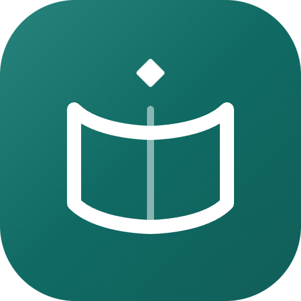
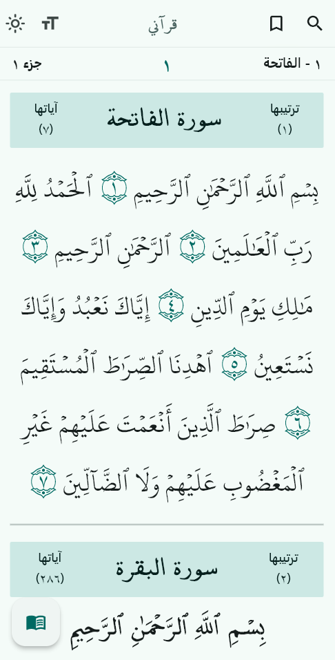
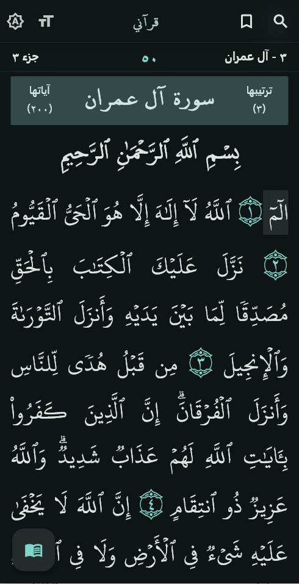
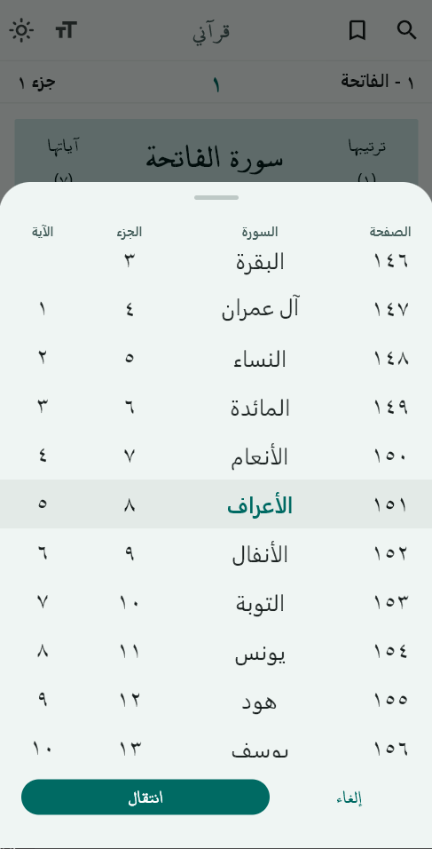

  <!-- LOGO -->
  
   

  #  My Quran | قرآني

  <!-- DOWNLOAD BUTTONS -->
  

  
  
  
   
   
  

  

---

  
  ###  يضم روايتي حفص عن عاصم وورش عن نافع
  حجم صغير، خصوصية تامة، بحث سريع ولا يحتاج اتصال بالانترنت.

  Lightweight. Fast search. No internet required. No analytics.
  
  Contains two readings: 'Hafs an Asm' and 'Warsh an Nafi' 
  

---

  
  
  

---

  
**تمّ بفضل الله**

